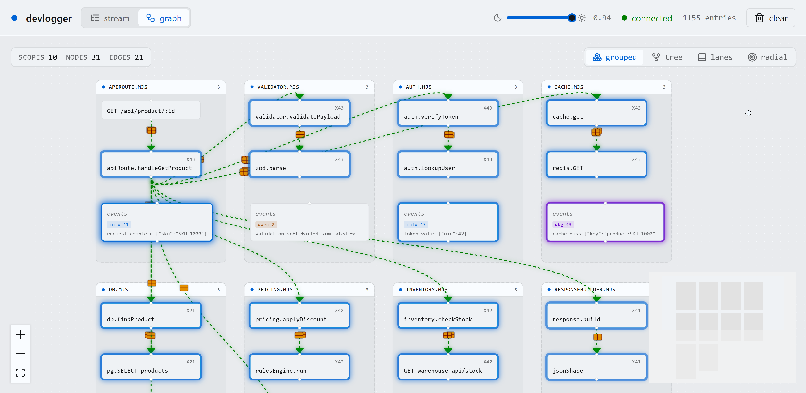
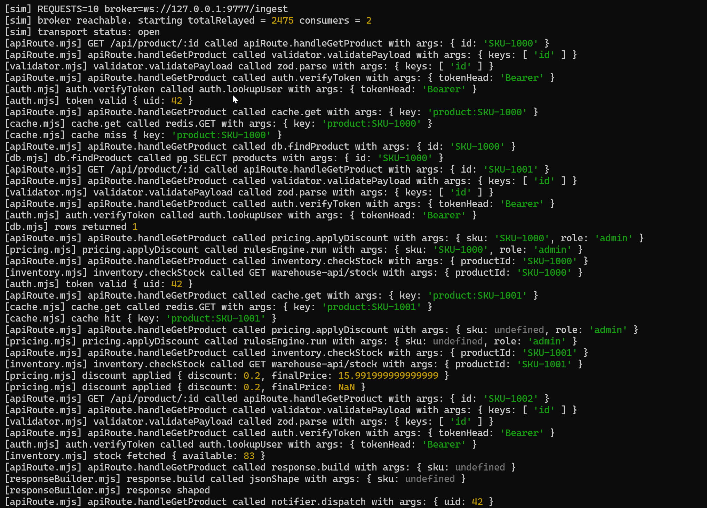

# @dariuszsikorski/devlogger

Structured, scope-aware console logger built for LLM-readable terminal output. Works in Node.js, modern bundlers, and plain browsers from a single import.

<p>
  
</p>

<p>
  
</p>

## At a glance - how devlogger differs from `console.log`

Same call site, different output. The scope tag (and a per-call counter when bursts collapse) makes terminal output instantly traceable to its source - especially useful for AI agents reading logs to reason about what happened.

```ts
// Same code on both sides:
log('Welcome in App!')
log('user signed in', { id: 42 })
for (let i = 0; i < 5; i++) log('frame tick')
```

```text
console.log                                  devlogger (scope = 'main.ts')
-----------------------------------          -----------------------------------
Welcome in App!                              [main.ts] Welcome in App!
user signed in { id: 42 }                    [main.ts] user signed in { id: 42 }
frame tick                                   [main.ts] frame tick
frame tick                                   [main.ts] frame tick (x5)
frame tick
frame tick
frame tick
```

Scope tags are on by default. Turn them off globally when you don't want them:

```ts
import { configure } from '@dariuszsikorski/devlogger'
configure({ showScope: false })
```

## Why `exec()` exists - tracing call graphs

`exec()` is a deliberately structured second form of logging. Instead of free-form `log(...)`, you describe the call as `{ by, target, args, msg }`:

```ts
log.exec({ by: 'main', target: 'init', args: { mode: 'dev' } })
// -> [main.ts] main called init with args: { mode: 'dev' }
```

The reason it looks "stiff" is intentional. When an AI agent (or a human) writes logs this way, every line carries the same fields: who called what, with what, why. That regularity lets you do things free-form `console.log` cannot:

- **Reconstruct call trees** from raw log streams - `by` is the parent, `target` is the child.
- **Subscribe** to the event stream (`subscribe(...)`) and render it live in vis.js, Cytoscape, D3, or any graph library - each entry already has the edge endpoints.
- **Enforce** the format at file or project level via `configure({ exec: { required: ['by','target'] } })` so contributors (or LLM coders) can't silently drop the tracking fields.
- **Diff and replay** sessions because the schema is stable.

Use plain `log(...)` for ad-hoc messages. Use `log.exec(...)` whenever you want the call to participate in the call graph or be inspectable as structured data.

## Why this exists

`console.log` is fine for humans skimming a stream. It is poor for AI agents that read terminal output trying to reconstruct what happened, and poor for noisy UIs that log the same thing 60 times per second. devlogger keeps the ergonomics of `console` while adding what is missing:

- Scope tags so logs from different parts of the app are distinguishable at a glance.
- Intelligent throttling so identical bursts collapse into one line with an `(xN)` counter, while genuinely different lines stay separate.
- A strict `exec()` form that enforces caller/target tracking when you opt in - useful for tracing call chains across modules.
- Per-scope and per-level muting so you can silence the noise without commenting out code.
- A pub/sub subscriber API so an in-app dev panel can render the same stream the terminal sees.
- Auto dev/prod detection with a manual `setEnabled()` escape hatch.

## Install

```sh
npm install @dariuszsikorski/devlogger
# or pnpm / yarn / bun
```

## Use

### Default singleton (drop-in for `console.log`)

```ts
import devLog from '@dariuszsikorski/devlogger'

devLog('hello')                // calls console.log
devLog.info('user signed in', { id: 42 })
devLog.warn('rate limit close')
devLog.error(new Error('boom'))
devLog.debug('frame', 17)
devLog.group('batch'); devLog.log('a'); devLog.log('b'); devLog.groupEnd()
```

Calling the logger with no method (`devLog(...)`) is equivalent to `devLog.log(...)` - the surface mirrors `console` exactly, so it is safe to swap in.

### Scoped logger

```ts
import { createDevLog } from '@dariuszsikorski/devlogger'

const log = createDevLog('Auth')
log('login attempt', { user: 'ada' })   // -> "[Auth] login attempt { user: 'ada' }"
log.warn('token expiring')
```

### Per-file scope pattern (recommended convention)

Register one scope at the top of every file - that file's name (or the module's role) becomes the tag prepended to every line it emits. The pattern keeps logs traceable to their origin without any caller-detection magic.

```ts
// auth-service.ts
import { createDevLog } from '@dariuszsikorski/devlogger'
const log = createDevLog('AuthService')

export async function login(creds) {
  log('login start', { user: creds.user })
  const ok = await verify(creds)
  if (!ok) { log.warn('login failed'); return null }
  log.info('login ok')
  return ok
}
```

```ts
// cart-store.ts
import { createDevLog } from '@dariuszsikorski/devlogger'
const log = createDevLog('CartStore')

export function addItem(item) {
  log('addItem', { sku: item.sku })
  // ...
}
```

Each file declares its own `log` once and uses it everywhere inside. Because every log line carries the file's scope, you can later silence or solo-focus one file globally:

```ts
import { muteScope } from '@dariuszsikorski/devlogger'
muteScope('CartStore')  // hides every line from cart-store.ts
```

Or via startup config:

```ts
configure({ mutedScopes: ['CartStore', 'Telemetry'] })
```

### Console passthrough - the rest of `console` works untouched

devlogger is essentially a thin wrapper around `console`. The methods it adds value to (`log` / `info` / `warn` / `error` / `debug` / `group` / `groupEnd`) gain the scope tag, throttling, muting, and subscriber emission. Every other standard `console` method is forwarded as-is, so you do not need to mix `log.info(...)` with `console.table(...)`.

```ts
const log = createDevLog('Cart')

log.table([{ sku: 'A', qty: 1 }, { sku: 'B', qty: 3 }])  // native console.table grid
log.time('checkout'); doWork(); log.timeEnd('checkout')  // native timer
log.count('hits'); log.count('hits')                     // 1, 2
log.trace('how did we get here?')                        // stack trace
log.assert(items.length > 0, 'cart should not be empty') // native assert semantics
log.dir(complexObject)                                   // inspectable dump
log.clear()
```

The full surface:

| Method | Behavior in devlogger |
|---|---|
| `log` / `info` / `warn` / `error` / `debug` | Wrapped - adds scope tag, throttling, mute checks, subscriber emission |
| `group` / `groupEnd` | Wrapped - scope tag applied to the group label |
| `exec` | New - structured call-chain logging (see below) |
| `mute` / `unmute` | New - per-instance scope toggle |
| `table` / `dir` / `trace` / `assert` | Forwarded - respects `enabled` and scope mute, no prefix or throttle |
| `time` / `timeEnd` / `timeLog` | Forwarded - timer labels stay intact |
| `count` / `countReset` | Forwarded - counter labels stay intact |
| `clear` | Forwarded |

Forwarded methods skip the `[Scope]` prefix on purpose - prefixing things like timer labels would break them (a label is an identity key). They still respect `setEnabled(false)` and `muteScope(...)`, so silencing a scope hides all of its output regardless of which method produced it.

### exec() - call-chain tracking with optional enforcement

```ts
const log = createDevLog('Cart')

log.exec({ by: 'CheckoutPage', target: 'addItem', args: { sku: 'X' } })
// -> [Cart] CheckoutPage called addItem with args: { sku: 'X' }

// Wrap a real function call - logs it, runs it, returns the result.
const total = log.exec({
  by: 'CheckoutPage',
  target: 'computeTotal',
  args: [items],
  fn: (xs) => xs.reduce((s, x) => s + x.price, 0),
})
// -> [Cart] CheckoutPage called computeTotal with args: [ ... ]
//    (computeTotal is then executed and its return value is returned through)
```

The output format adapts to what you supply - missing pieces are dropped gracefully:

```text
{ by: 'main', target: 'init' }                              -> main called init
{ by: 'main', target: 'init', args: { mode: 'dev' } }       -> main called init with args: { mode: 'dev' }
{ by: 'main', target: 'init', msg: 'startup' }              -> main called init | startup
{ by: 'main', target: 'init', msg: 'x', args: { ... } }     -> main called init | x with args: { ... }
{ target: 'init' }                                          -> init                       (no "X called")
{ by: 'main' }                                              -> main
{}                                                          -> <exec>                     (fallback)
```

Empty args (`{}` or `[]`) suppress the `with args:` suffix - only meaningful payloads are surfaced. The actual `args` object is passed as a separate console argument so DevTools and Node keep it inspectable instead of stringifying it.

You can require fields globally - missing fields produce a `console.error` and the call is skipped (the wrapped fn, if any, still runs so app flow never breaks):

```ts
import { configure } from '@dariuszsikorski/devlogger'

configure({ exec: { required: ['by', 'target'] } })
```

### Throttling

Throttling is on by default with a 200 ms window. Identical-shape calls within the window are folded:

```ts
for (let i = 0; i < 50; i++) log('frame', { n: i })
// terminal:
//   [Cart] frame { n: 0 }
//   [Cart] frame { n: 49 } (x50)
```

"Identical shape" means the same level, same scope, same first-string argument, and the same set of object keys / argument types. Different content prints normally:

```ts
log('apple'); log('banana'); log('cherry')
// three separate lines, no merging
```

Disable or change the window:

```ts
configure({ throttleMs: 0 })   // off
configure({ throttleMs: 500 }) // slower window
```

### Muting

```ts
import { muteScope, unmuteScope, muteLevel } from '@dariuszsikorski/devlogger'

muteScope('Noisy')        // hide every log from createDevLog('Noisy')
muteLevel('debug')        // hide all .debug() across scopes

log.mute(); log.unmute()  // per-instance toggle
```

Configure mutes at startup:

```ts
configure({
  mutedScopes: ['Noisy', 'Pings'],
  mutedLevels: ['debug'],
})
```

### Subscribers

Stream every entry to a custom sink - dev panel, file writer, remote log shipper:

```ts
import { subscribe } from '@dariuszsikorski/devlogger'

const off = subscribe((entry) => {
  // entry: { level, scope, args, timestamp, count }
  panel.append(entry)
})

// later
off()
```

### Manual on/off

```ts
import { setEnabled, isEnabled } from '@dariuszsikorski/devlogger'

setEnabled(false)         // hard kill - nothing emits
setEnabled(true)
```

By default, devlogger is enabled. It tries to detect `import.meta.env.DEV` (Vite, modern bundlers) and `process.env.NODE_ENV === 'production'` (Node, Next.js), and disables itself in production builds. When detection cannot decide, it stays on - logs are visible until you explicitly say otherwise.

### Browser via CDN

For pages without a bundler:

```html
<script src="https://unpkg.com/@dariuszsikorski/devlogger"></script>
<script>
  const { default: devLog, createDevLog } = DevLogger
  devLog('hello from a plain script tag')
  const log = createDevLog('Page')
  log.info('ready')
</script>
```

The IIFE bundle exposes a global named `DevLogger` containing the full module.

## API reference

| Export | What it does |
|---|---|
| `devLog` (default) | Unscoped singleton. Callable + wrapped `.log/.info/.warn/.error/.debug/.group/.groupEnd`, plus `.exec/.mute/.unmute`, plus forwarded `.table/.dir/.trace/.assert/.time/.timeEnd/.timeLog/.count/.countReset/.clear` |
| `createDevLog(scope?)` | Build a scoped logger with the same surface |
| `configure(input)` | Update global config: `enabled`, `throttleMs`, `emoji`, `showScope`, `exec.required`, `mutedScopes`, `mutedLevels` |
| `setEnabled(bool)` | Toggle the global kill switch |
| `isEnabled()` | Current enabled state |
| `getConfig()` | Read-only view of the active config object |
| `subscribe(handler)` | Attach a listener; returns an unsubscribe fn |
| `unsubscribeAll()` | Drop every listener |
| `muteScope(name)` / `unmuteScope(name)` | Per-scope mute |
| `muteLevel(level)` / `unmuteLevel(level)` | Per-level mute |
| `getMutedScopes()` / `getMutedLevels()` | Current mute lists |
| `clearMutes()` | Wipe all mutes |
| `flushAll(emit?)` | Force-emit any pending throttled summaries |
| `resetThrottle()` | Drop throttle state without emitting (for tests) |

## Self-test

Every feature has a section in [selftest.mjs](./selftest.mjs). Run it after building:

```sh
pnpm build
pnpm selftest
```

Each section prints `EXPECT:` followed by the actual output, so an LLM (or you) can scan the terminal and confirm behavior without writing assertion-based tests. There is also a CJS smoke (`node selftest.cjs`).

## Build

```sh
pnpm install
pnpm build
```

Outputs:

- `dist/index.mjs` - ESM, for modern bundlers and Node ESM
- `dist/index.cjs` - CommonJS, for older Node and tooling
- `dist/index.global.js` - IIFE with global name `DevLogger`, for `<script>` tags
- `dist/index.d.ts` (+ `.d.cts`) - TypeScript types

## Repository layout

```
logger/         library source + dist (the published `@dariuszsikorski/devlogger` package)
  src/
    index.ts        public exports + default singleton
    devlog.ts       createDevLog factory
    types.ts        shared type definitions
    env.ts          dev/prod auto-detection
    config.ts       global config singleton
    format.ts       prefix builder + structural arg hash
    throttle.ts     intelligent batch with (xN) summary
    mute.ts         scope and level mute registry
    subscribe.ts    pub/sub
    exec.ts         exec() with required-field enforcement
    transport.ts    fire-and-forget WS client to the viewer broker
  dist/             build artifacts (ESM/CJS/IIFE + .d.ts)
  selftest.mjs      smoke test
  tsup.config.ts
  tsconfig.json

viewer/         local broker + minimal web UI for live log inspection
  server.ts         Fastify broker - WS /ingest (producers) + WS /stream (consumers) + static UI
  public/           dark-themed live viewer (search + filter + auto-scroll)

simulation/     end-to-end verification harness
  handlers/         10 fake modules with realistic call chain
  run.mjs           sim runner + parity check against the broker
  headless-consumer.mjs  emulates the browser viewer for CI-style verification
```

The root `package.json` is the published library; `viewer/` and `simulation/` are dev-only sub-projects with their own scripts and (when needed) their own `node_modules`.

Common scripts from the repository root:

```bash
pnpm build          # builds logger/dist
pnpm viewer         # starts broker + auto-opens the web viewer
pnpm viewer:tunnel  # starts broker + Cloudflare quick tunnel (public URL)
pnpm sim            # runs the simulation suite
pnpm selftest       # quick library self-test
```

## Remote viewing - debug from a phone or any external device

Sometimes you want to watch the log stream from outside your machine - on a phone during a walk, on a tablet on the other side of the room, on a colleague's laptop. The broker only binds to `127.0.0.1`, so it is not directly reachable. `pnpm viewer:tunnel` solves this by starting the broker and a [Cloudflare quick tunnel](https://developers.cloudflare.com/cloudflare-one/connections/connect-networks/do-more-with-tunnels/trycloudflare/) side by side. The tunnel makes an outbound connection to Cloudflare and assigns a public HTTPS URL - no port forwarding, no public IP, no account required.

```sh
pnpm viewer:build      # one-time (or after viewer source changes)
pnpm viewer:tunnel
```

Output looks like:

```text
[devlogger-tunnel] starting broker on http://127.0.0.1:9777 ...
[devlogger-tunnel] starting Cloudflare quick tunnel ...
+--------------------------------------------------------------------------------------------+
|  Your quick Tunnel has been created! Visit it at (it may take some time to be reachable):  |
|  https://<random-words>.trycloudflare.com                                                  |
+--------------------------------------------------------------------------------------------+
```

Open that URL on any device. The viewer's WebSocket upgrades automatically to `wss://` so it works over HTTPS.

Prerequisites:

```sh
# Windows
winget install Cloudflare.cloudflared
# macOS
brew install cloudflared
# Linux: see https://developers.cloudflare.com/cloudflare-one/connections/connect-networks/downloads/
```

If `cloudflared` lives somewhere unusual, point at it with the `CLOUDFLARED` env var.

Notes:

- Quick tunnel URLs are ephemeral - each restart gives a new one. For a stable address use a [named tunnel](https://developers.cloudflare.com/cloudflare-one/connections/connect-networks/) tied to a Cloudflare account.
- The tunnel is public for anyone who guesses the URL. Treat the viewer as anonymous read-only - no secrets in your log payloads while a tunnel is open.
- Override the local port with `DEVLOGGER_PORT` (default `9777`).

Files are kept small and single-purpose to make future tests and contributions straightforward.

## Author and license

Dariusz Sikorski - https://www.dariuszsikorski.pl

Released under the MIT License - see [LICENSE](./LICENSE).
